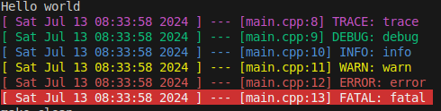

# C++ Starter
C++ program to get projects started and going on Linux Enviornment
## ⭐ Features

### Enhanced

- Colored logging
- Interactive standard input
- Easy object construction

### Additional

- Unit Testing
- Debugging

## ❗ PreReqs

```bash
sudo apt update
sudo apt install g++
sudo apt install make
```

## 🚀 Getting Started


Run the main file by using ``make run``

#### Your console should look something like this




## 🧪 Unit Tests

### Setting Up GTest

#### Automatically
Run this command: ``make setup-tests`` 
#### Manually
```bash
# fetch the library
sudo apt-get install libgtest-dev

# mark current workspace directory
PROJ_DIR=$PWD

# install and unpack gtest files
sudo apt-get install cmake # install cmake
cd /usr/src/gtest
sudo cmake CMakeLists.txt
sudo make
 
# copy or symlink libgtest.a and libgtest_main.a to your /usr/lib folder
sudo cp *.a /usr/lib

# navigate back to workspace
cd $PROJ_DIR

# Lets see if it works
make test
```

#### Your console should look something like this
```txt
Running main() from ./googletest/src/gtest_main.cc
[==========] Running 0 tests from 0 test suites.
[==========] 0 tests from 0 test suites ran. (0 ms total)
[  PASSED  ] 0 tests.
```

### Generate a test file
1. Run ``make testfile``
2. You will be prompted: ``Enter name of new test case: ``
3. Enter "Sample" or any other word w/ NO SPACES
4. Run ``make test``

#### Your console should look something like this

```txt
Running main() from ./googletest/src/gtest_main.cc
[==========] Running 1 test from 1 test suite.
[----------] Global test environment set-up.
[----------] 1 test from SampleTest
[ RUN      ] SampleTest.TestDescription
[       OK ] SampleTest.TestDescription (0 ms)
[----------] 1 test from SampleTest (0 ms total)

[----------] Global test environment tear-down
[==========] 1 test from 1 test suite ran. (0 ms total)
[  PASSED  ] 1 test.
```

### Writing a Sample TestCase
1. Open ``tests/SampleTests.cpp``
2. Modify your code so it looks like this (or just copy and paste)
```c++
#include <gtest/gtest.h>

bool pow2(const int &x)
{
    if ((x <= 0) || ((x % 2 != 0) && (x > 1)))
        return false;
    if (x == 1)
        return true;
    return pow2(x / 2);
}
TEST(SampleTest, PowerOf2True)
{
    EXPECT_TRUE(pow2(256));
}
```

## 🪲 Debugging

### VSCode
1. ``make debug-init`` => Generates vscode debug files and opens VSCode
    - You will be prompted to choose main or test files
    ```txt
    Which program are you debugging?
    (m)ain
    (t)est
    Enter a choice: 
    ```
2. VsCode Menu ->``Run`` -> ``Start Debugging``

### GDB
-  ``make debug`` => Build and runs main file in gdb
-  ``make debug-tests`` => Build and runs test files in gdb

## ⌨️ Interactive Standard Input (example)

```cpp
#include <input.hpp>
#include <console.hpp>

int main(int argc, char **argv)
{
    auto name = input<string>("Enter your name: ");
    auto age = input<int>("Enter your age: ");
    LOG(name, age);
    return 0;
}
```

## 🧰 Easy Object Construction (example)

### 

```cpp
#include <objects.hpp>

using namespace objects;
int main(int argc, char **argv)
{
    // str is a pointer type => string *
    auto str = construct<string>("string ptr");
    
    /*
    ...
    // some code here
    ...
    */

    // DON'T FORGET TO CLEANUP
    destroy(str);

    return 0;
}
```